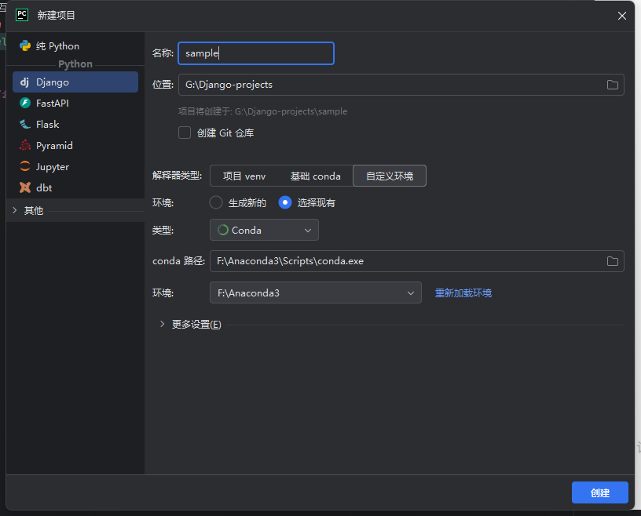
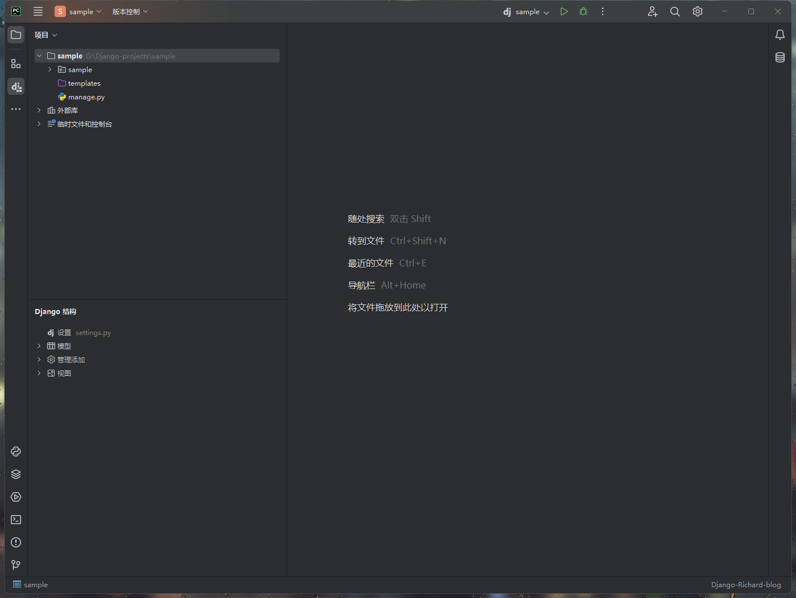

# Python Django后端部署web项目

* pycharm新建项目
  

* 删除新建项目中的`templates`文件
  

* 在新建的项目名文件夹配置
    * ALLOWED_HOSTS允许访问的地址设置
  ```python
  ALLOWED_HOSTS = ['*']
  ```
    * 配置templates文件路径清空
  
  ```python
  TEMPLATES = [
      {
          "BACKEND": "django.template.backends.django.DjangoTemplates",
          "DIRS": [],
          "APP_DIRS": True,
          "OPTIONS": {
              "context_processors": [
                  "django.template.context_processors.debug",
                  "django.template.context_processors.request",
                  "django.contrib.auth.context_processors.auth",
                  "django.contrib.messages.context_processors.messages",
              ],
          },
      },
  ]
  ```
  
  * 配置数据库`MySQL`为例
  
  ```python
  DATABASES = {
      'default': {
          'ENGINE': 'django.db.backends.mysql',
          'NAME': 'richard_blog',
          'USER': 'your_mysql_root',
          'PASSWORD': 'your_password',
          'HOST': 'localhost',
          'PORT': '3306',
          'OPTIONS': {
              'init_command': "SET sql_mode='STRICT_TRANS_TABLES'",
              'charset': 'utf8mb4',
          },
          'MYSQL': {
              'driver': 'pymysql',
              'charset': 'utf8mb4',
          },
      }
  }
  ```
  
  * 配置静态资源static文件路径
  
  ```python
  STATIC_URL = "static/"
  STATIC_DIRS = [
      os.path.join(BASE_DIR, 'static')
  ]
  ```

* 创建APP

  * 在终端输入

    ```bash
    python manage.py start [your_app_name]
    ```

  * 项目出现一个文件

  * 进入这个文件夹，创建文件

    ```bash
    ├─migrations
    │  └─__pycache__
    ├─static                #创建static静态资源文件夹
    │  ├─css                #存放前端页面中CSS样式
    │  ├─img				#存放前端页面中图像文件
    │  ├─js					#存放前端页面中js文件
    │  └─plugins			#存放前端页面中用到的插件
    ├─templates				#创建templates文件夹 存放网页html文件
    └─__pycache__
    ```

  * 在该文件夹中配置`model.py`文件，用于创建数据库

    ```python
    from django.db import models
    
    
    class life_dynamic(models.Model):
        """ 员工表 """
        imgSrc = models.CharField(verbose_name="图像路径", max_length=16)
        title = models.CharField(verbose_name="动态标题", max_length=64)
        text = models.IntegerField(verbose_name="动态文案", max_length=128)
        date = models.DateTimeField(verbose_name="动态时间")
    ```

  * 在该文件夹配置`views.py`文件

    ```python
    from django.shortcuts import render, redirect
    from app01 import models
    
    
    def home(request):
        """ 官网主页 """
        return render(request, "home.html")
    
    
    def life(request):
        """ 生活动态 """
        return render(request, "life.html")
    
    
    def study(request):
        """ 学习分享 """
        return render(request, "study.html")
    
    ```

  * 返回上一级文件夹，打开项目原有文件夹，配置路由`urls.py`文件

    ```python
    """Richard_blog URL Configuration
    
    The `urlpatterns` list routes URLs to views. For more information please see:
        https://docs.djangoproject.com/en/4.1/topics/http/urls/
    Examples:
    Function views
        1. Add an import:  from my_app import views
        2. Add a URL to urlpatterns:  path('', views.home, name='home')
    Class-based views
        1. Add an import:  from other_app.views import Home
        2. Add a URL to urlpatterns:  path('', Home.as_view(), name='home')
    Including another URLconf
        1. Import the include() function: from django.urls import include, path
        2. Add a URL to urlpatterns:  path('blog/', include('blog.urls'))
    """
    from django.contrib import admin
    from django.urls import path
    from app01 import views
    
    urlpatterns = [
        path('admin/', admin.site.urls),
        path('home/', views.home),
        path('life/', views.life),
        path('study/', views.study),
    ]
    ```

  * 在pycharm终端输入指令应用创建的app

    ```bash
    python manage.py makemigrations
    python manage.py migrate 
    ```

* 运行

  * 运行框会出现：

    ```bash
    September 25, 2024 - 00:34:36
    Django version 4.1, using settings 'Richard_blog.settings'
    Starting development server at http://localhost:8000/
    Quit the server with CTRL-BREAK.
    ```

  * 点击网址`http://localhost:8000/`

  * 会出现网页

  * 将其中的路由拼接复制到浏览器网址输入框中`http://localhost:8000/home/`


## 恭喜你！成功部署了自己的django后端web网站


