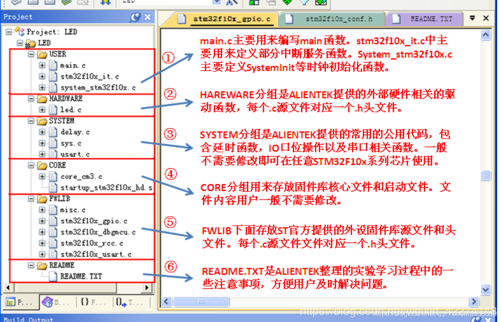
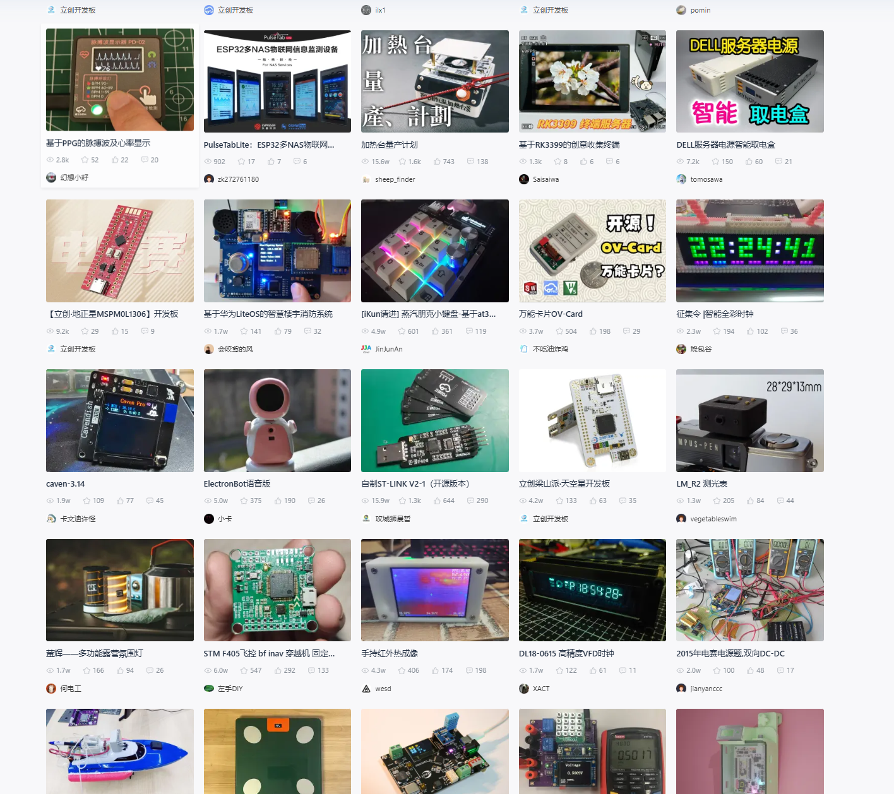

# 嵌入式开发学习路线


## 基础篇

* 基础

  * 编程语言:C/C++

    ```tex
    - 数据类型
    	- 整型（Integer Types）：
            - int：用于表示整数。
            - short：通常比int短，用于节省空间。
            - long：通常比int长，用于表示更大范围的整数。
            - long long：C99标准引入，用于表示比long更大范围的整数。
        - 字符型（Character Types）：
            - char：用于表示单个字符，通常占用一个字节。
            - 浮点型（Floating-Point Types）：
            - float：单精度浮点数。
            - double：双精度浮点数。
            - long double：通常比double有更高的精度。
        - 构造类型（Constructed Types）：
            - 数组（Array）：一系列相同类型的数据项。
            - 结构体（Structure）：允许将不同的数据类型组合在一起。
            - 联合（Union）：允许在相同的内存位置存储不同的数据类型。
            - 枚举（Enumeration）：一组命名的整型常量。
            - 指针类型（Pointer Types）：
            - 任何数据类型的指针，例如int *表示指向整数的指针。
            - 空类型（Void Type）：
    - 变量
    - 运算符
    - 循环和条件语句
    - 指针
    - 结构体
    
    
    语法、循环、条件语句、指针、结构体懂了就可以了
    ```

  * 51单片机

    ```tex
    我当时学习是为了打比赛：蓝桥杯单片机设计与开发
    这里我推荐b站上江科大的学习，非常好
    学习思路：
    - 买一块51开发板，价格就一百来块钱，里面要包含：led灯、数码管、矩阵按键、步进电机、温度传感器、串口通讯
    - 任何一个单片机课程第一堂课都是：点亮你的led灯 还有一些pwm灯亮
    - 数码管：要知道动态显示和静态显示
    - 矩阵按键：要知道消抖操作、扫描行列
    - 中断：理解中断真正的含义：就是让单片机和人一样选择哪些重要的事情先做完，再做剩下的事情
    - 温度传感器：采集到的数据不是10进制的数据，懂得如何进制转换，会看传感器的产品手册、I2C、协议
    - 串口通讯：波特率匹配、上位机下位机
    ```

    视频课程：[江协科技的个人空间-江协科技个人主页-哔哩哔哩视频 (bilibili.com)](https://space.bilibili.com/383400717?spm_id_from=333.337.0.0)

  * 模块化管理代码，避免自己的代码成为`屎山代码`

    ```
    我刚开始学习c语言的时候，写单片机的代码，只创建一个.c文件，然后在里面写了很多函数、很多操作，一个代码文件有几十页，这样的代码是屎山代码
    基本上单片机的文件结构：
    Documentation/
    │
    ├── USER/                     # 主程序
    │   ├── main.c                # 主函数，实现功能所有的功能用到的函数汇集到主函数里面进行操作
    │   ├── stm32f10x_it.c        # 中断服务函数
    │   └── system_stm32f10x.c	  # 时钟初始化
    │
    ├── HARDWARE/                 # 外设文件
    │   ├── delay.c               # 功能介绍
    │   ├── sys.c                 # 使用说明
    │   └── usart.c               # 常见问题解答
    │
    ├── CORE/                     # 开发板芯片的固件库
    │   └── core_cm3              
    │
    ├── FWLIB/                    # 开发板外设的固件库
    │   ├── misc.c                
    │   ├── stm32f10x_gpio.c      
    │   ├── stm32f10x_dbgmcu.c    
    │   ├── stm32f10x_rcc.c       
    │   ├── stm32f10x_usart.c     
    │   └── troubleshooting.md    
    │
    └── README/                   # 附录
        └── README.md             
    
    ```
    
  * stm32

    * 这里面内容就太多了，具体学习就直接无脑跟着b站上江科大的视频课程
    * 视频链接：[江协科技的个人空间-江协科技个人主页-哔哩哔哩视频 (bilibili.com)](https://space.bilibili.com/383400717?spm_id_from=333.337.0.0)


## 提高篇

* pcb电路板：学会看电路图是非常重要的，这里推荐一个国产的画pcb电路板的企业嘉立创

  [国产嘉立创EDA - 一个用心为中国人定制的电路板开发平台 (lceda.cn)](https://lceda.cn/)

* linux操作系统

  * 为什么要学习linux？

    ```
    我们平时用的系统大部分windows，也有macos，之所以很多专业需要用到linux系统我的理解是这样的：
    1.我们使用的windows有版权，公司做开发，需要将项目部署到服务器上，如果将项目部署到windows上是要给微软掏钱的，而Linux系统不需要钱，很多公司降本增效就会使用linux系统，这是第一点
    2.第二点是因为，在做项目时从很早就有linux系统一直到今天，整个生态是非常强大的，很多操作、库等等资源都很完善，所以更倾向于用linux开发
    3.嵌入式物联网开发需要linux系统：是因为物联网，物联网就需要联网，联网后就需要云计算平台，云端云计算平台基于要linux部署服务器，所以我们学习嵌入式开发就需要学会linux操作系统的一些知识
    ```

  * linux指令集（就是用指令来操控我们的电脑，很简单，一般都是不会就去上网查）

* rtos实时系统
  * 从这儿开始我就没怎么学习了，有会的小伙伴欢迎补充
* fpga
* web开发
* 数据库


## 实战篇

* 如果觉得自己学的可以，就可以去实战一下，之前说的嘉立创开源平台有很多有意思的项目，可以自己选择一个，他会把电路板原理图和boom表（所需的硬件）会罗列出来，然后平台上有的也会把github、gitee的代码项目给出来，可以跟着做一个，对自己的提升很大
